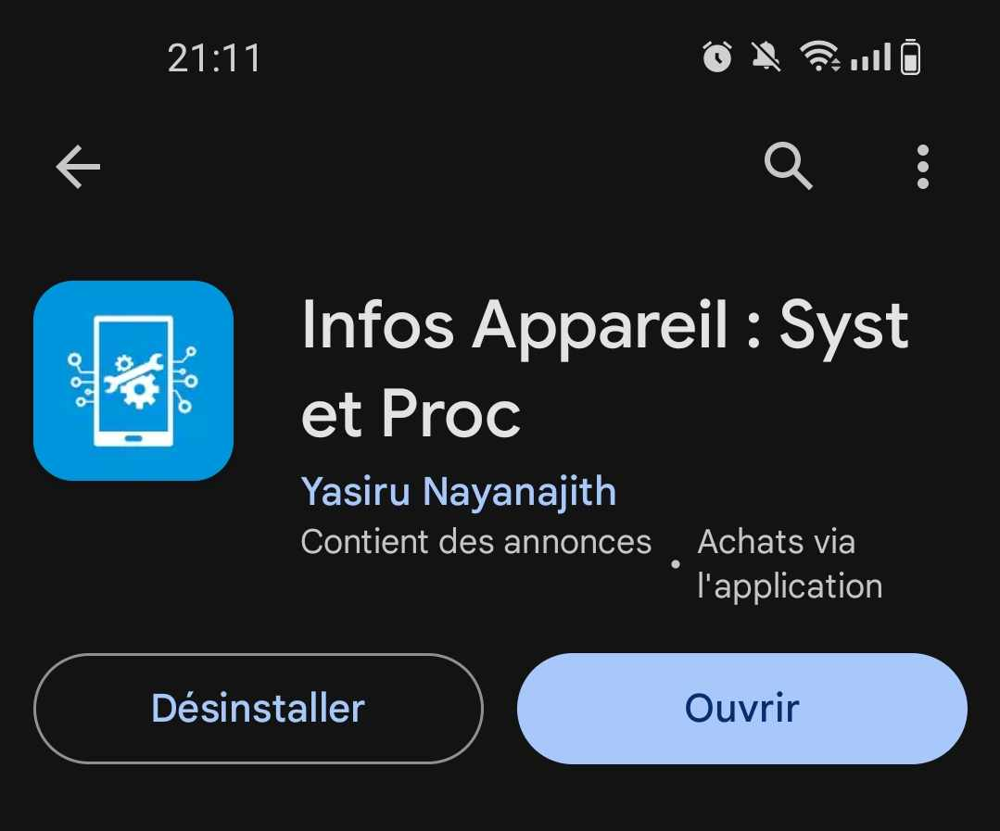
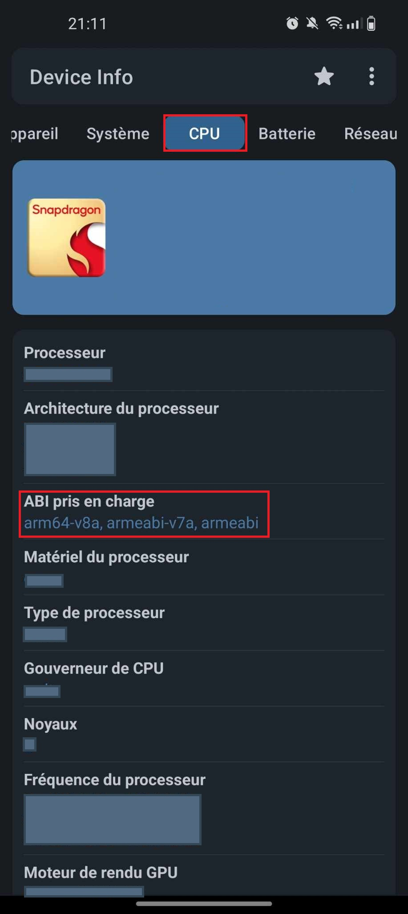
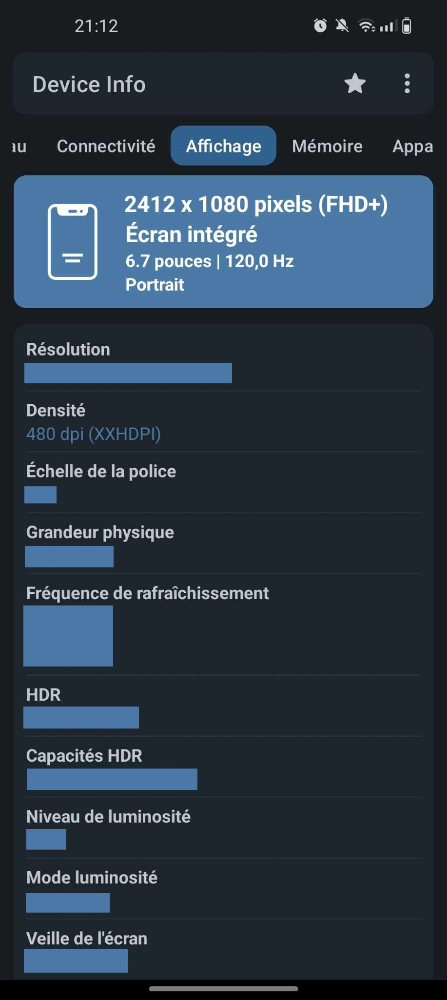
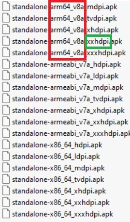

# astroremote

Application de contrôle de moteur pour téléscope. 
Le contrôle du téléscope n'est pas présent sur ce github.

## Getting Started

### Installation 

#### Android

Sur le play store installer l'application : [Infos Appareil : Syst et Proc](https://play.google.com/store/apps/details?id=com.ytheekshana.deviceinfo&pcampaignid=web_share). 
Ou autre application permettant d'obtenir les informations système. 

Exemple avec l'application `Infos Appareil : Syst et Proc` :

Une fois l'application téléchargée, ouvrer la et cliquer sur le menu CPU : 

Il faut récupérer les informations dans la catégorie ABI pris en charge. Dans mon cas on voit arm64-v8a. 

Il faut ensuite se rendre dans le menu affichage, en scrollant vers la gauche : 

 

Ici la catégorie densité nous interresse, il faut noter ce qu'il y a entre les parenthèse, ici : XXHDPI.

##### Choix de l'apk a télécharger 

Une fois avec les informations de votre téléphone, vous pouvez choisir votre apk qu'il faut télécharger. 

Reprennons mon exemple, mes informations sont : 
- ABI : arm64-v8a (information en rouge)
- Densité : XXHDPI (information en vert)

Sélectionner le bon fichier et télécharger le sur votre appareil. 

Pour l'installer il faut cliquer sur le fichier, vous devriez le trouver sous le dossier Téléchargement de votre appareil. 

L'appareil vous informera que c'est une application venant d'une source non vérifiée car l'application en vient pas du playstore. Il faut donc autorisé l'installation d'application de source tierce.

> (Il faurda bien évidemment pour des raison de sécurité remettre le paramètre par défaut une fois l'application installé pour éviter l'installation non voulue d'applications malveillantes).

L'installation est terminée.  

#### IOS 
C'est pourri on verra plus tard :) 
